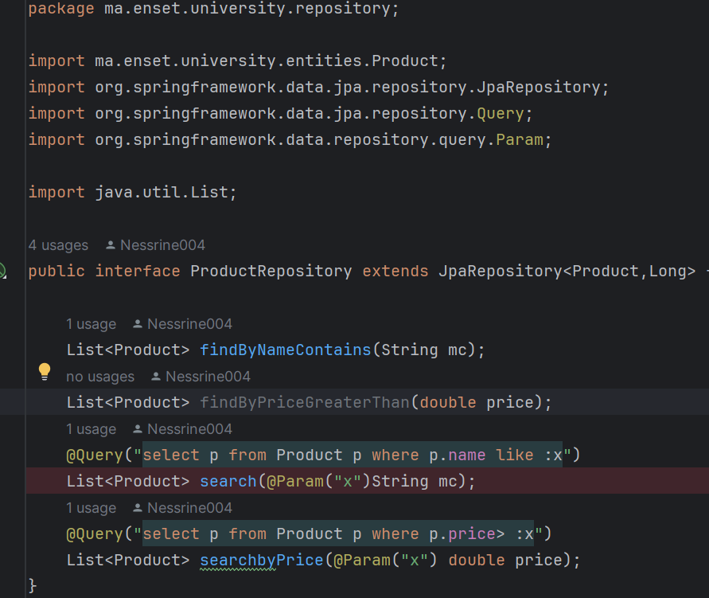
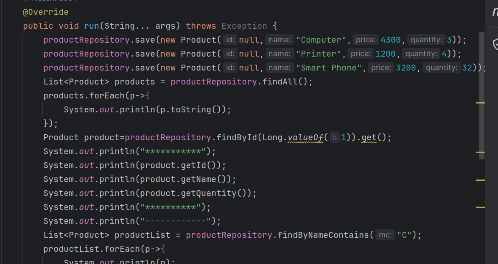
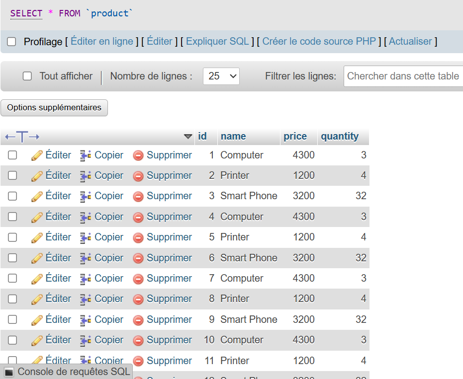

<h2>ORM JPA Hibernate Spring Data</h2>
<h4>JPA Product </h4>

<h4>Configurer l'unité de persistance dans le ficher application.properties</h4>

<h4> Créer l'interface JPA Repository basée sur Spring data</h4>

<h4>Ajouter des produits</h4>

