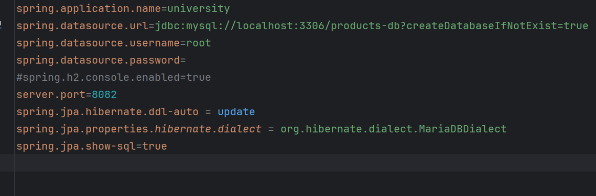
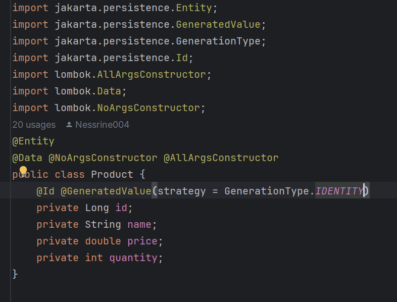

<h2>ORM JPA Hibernate Spring Data</h2>
<h4>JPA Product </h4>

<h4>Le fichier config.xml</h4>

<h4> l'interface IDao avec une méthode getData</h4>

<h4>l'implémentation de l'interface IDao</h4>

<h4>l'interface IMetier avec une méthode calcul</h4>
